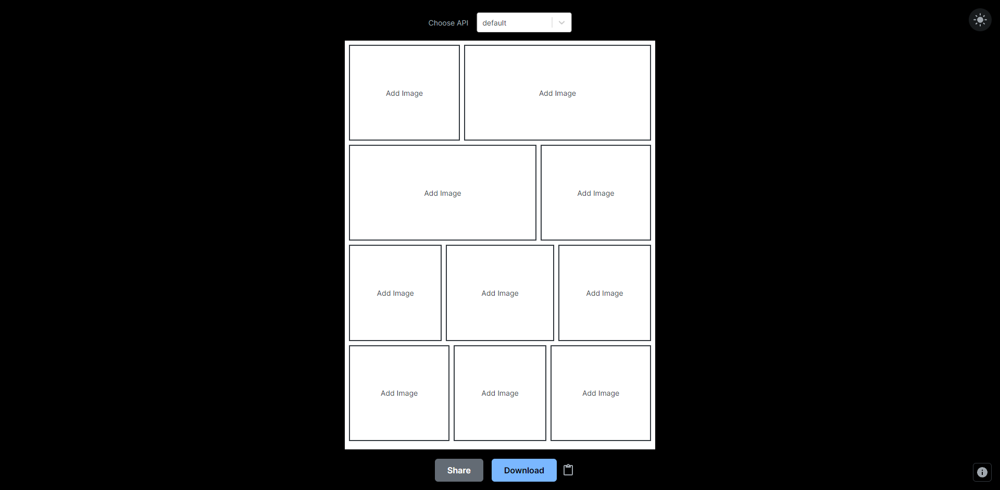
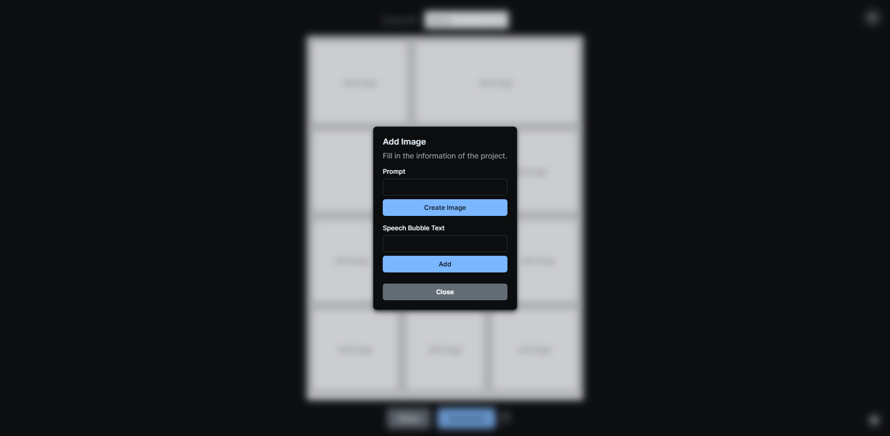
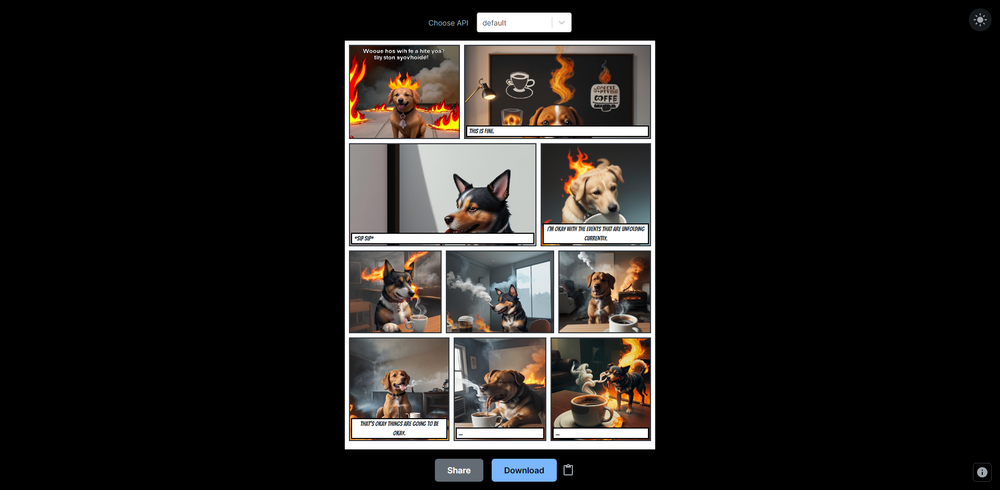
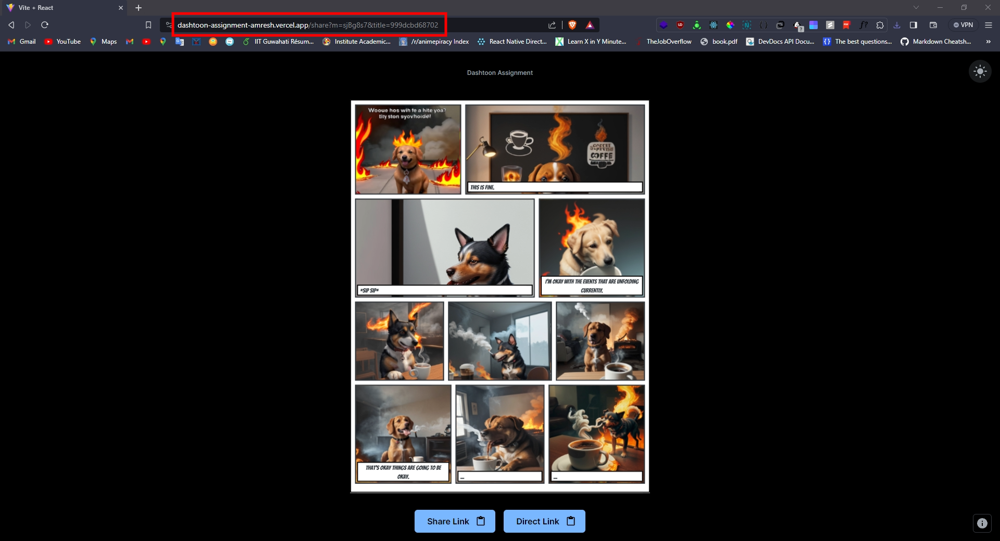

    

# Dashtoon Assignment

- Link: https://dashtoon-assignment-amresh.vercel.app/
- Name: Vikas Yadav
- Email: yvikas8340@gmail.com
- Roll No.: 20035067
- College: IIT (BHU) Varanasi

## Table of Content

- [Features & Todo](#features--todo)
- [Usage](#usage)
- [Installation](#installation)
- [Screenshots](#screenshots)
- [Built With](#built-with)

## Features & Todo

Features:
- Responsive
- Light Mode(default)/Dark Mode
- 10-Panel Grid
- Speech Bubble Support
- Download Option, Shareable Link (web share, direct link)
- Uses Imgbb API for uploading images
- Option for 2 Models:
  - default: Provided in the assignment
  - comic-diffusion: Added because the default one was not working or working very slow

Todo:
- [ ] Add more layouts
- [ ] More customisable speech bubbles
- [ ] Pages

## Usage

1. Click on Get Started button on Home Page
2. In the 10-panel grid, click on the panel in which you want to add image and speech bubble. Don't close the grid until the image generation notification arrives. Do for all the required panels.
3. Once done, click on either Share, Download or Copy button as per your needs.
4. On Clicking Share button, you will be redirected to the third screen where you can see the image. That page link is sharable. You can either copy that or the direct link using the buttons at the bottom.

## Installation

1. Clone the repo
2. Run `yarn install` to install all the dependencies
3. Rename `.env.sample` to `.env.local` and fill in the necessary secrets
4. Run `yarn dev` to start the development server

## Screenshots

    
    
    
    
    

## Built With

- [React.js](https://reactjs.org/)
- [React-Router](https://reactrouter.com/)
- [Mui](https://mui.com/)
- [Html2Canvas](https://html2canvas.hertzen.com/)
- [React-Toastify](https://fkhadra.github.io/react-toastify/introduction)
- [Hugging Face API](https://huggingface.co/)
- [Imgbb](https://api.imgbb.com/)
